# ДЗ 1. Байесовская генерация и автоэнкодеры

---

# **Байесовский генератор стилей**
### Краткое описание: реализовать генератор стилей и генератор аватаров на основе MLE и формулы Байеса

---

## **1. Генерация стиля**
   
**Примеры вывода:**

Ниже приведены примеры сгенерированных стилей и их вероятности (по эмпирическим распределениям из таблицы):

```
Пример 1:
  прическа: короткая прямые
  цвет волос: серебристо серый
  аксесуар: круглые очки
  одежда: комбинезон
  цвет одежды: серый
  P(стиль) = 0.00201

Пример 2:
  прическа: длинные прямые
  цвет волос: черный
  аксесуар: круглые очки
  одежда: футболка с круглым вырезом
  цвет одежды: серый
  P(стиль) = 0.00129

Пример 3:
  прическа: нет волос
  цвет волос: серебристо серый
  аксесуар: круглые очки
  одежда: футболка с круглым вырезом
  цвет одежды: черный
  P(стиль) = 0.00090

Пример 4:
  прическа: длинные прямые
  цвет волос: блонд
  аксесуар: нет очков
  одежда: комбинезон
  цвет одежды: розовый
  P(стиль) = 0.00070

Пример 5:
  прическа: длинные прямые
  цвет волос: серебристо серый
  аксесуар: нет очков
  одежда: комбинезон
  цвет одежды: красный
  P(стиль) = 0.00245
```

*(вероятности рассчитаны как произведение вероятностей признаков:  
P(style) = P(прическа) × P(цвет волос) × P(аксессуар) × P(одежда) × P(цвет одежды))*

#### Таблица распределений признаков
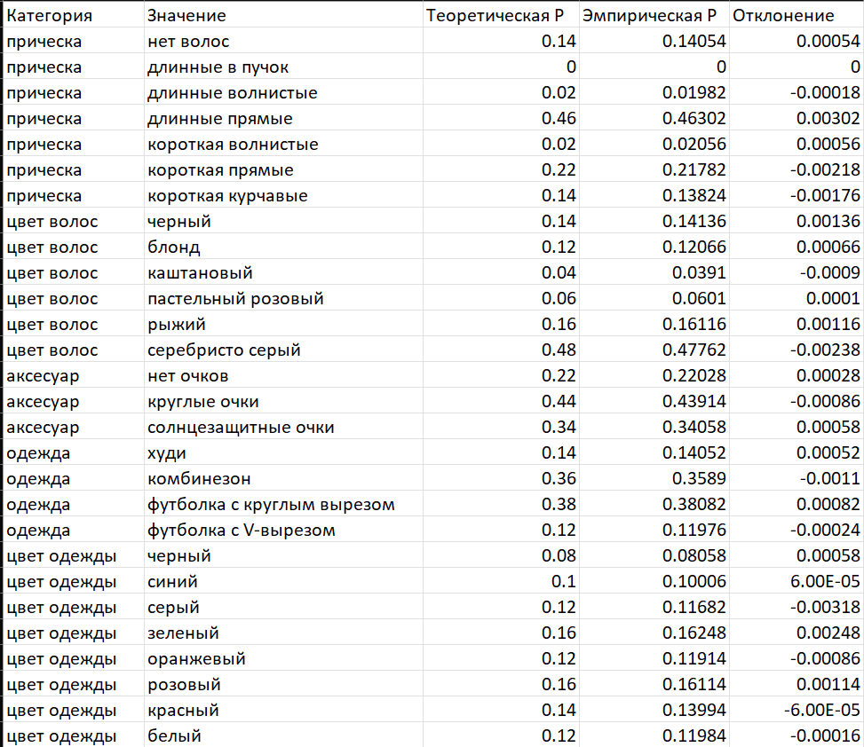


---

## **2. Генерация аватара**

**Примеры вывода:**

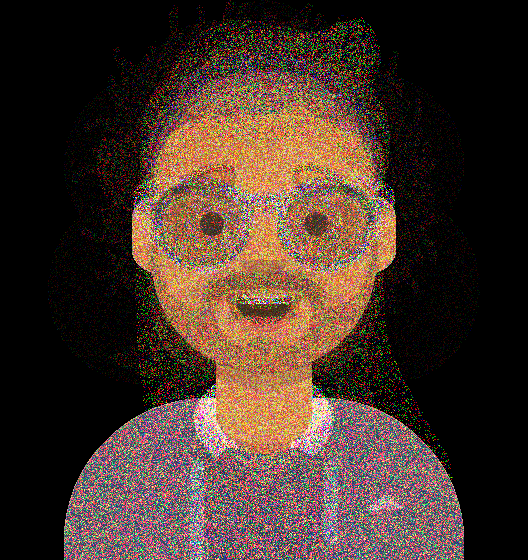

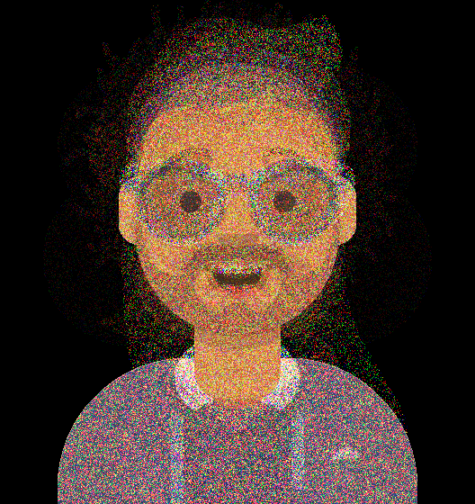

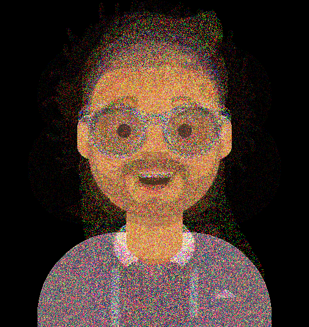

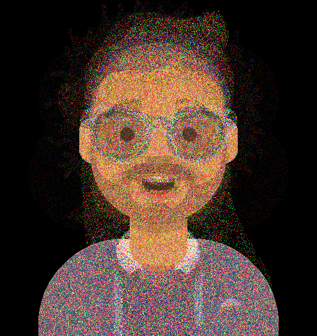

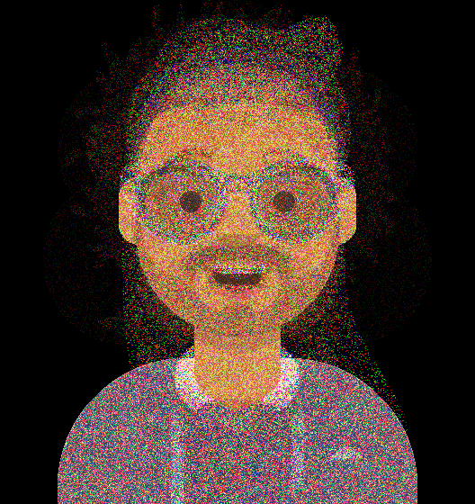

Для пяти сгенерированных изображений итоговые вероятности оказались **P ≈ 0.0**.  
Причина — перемножение тысяч малых вероятностей (по всем пикселям и каналам RGB), что уводит результат в **численное underflow**.  

Для анализа использованы распределения каналов:  

#### Гистограммы RGB
- Канал **R**  
  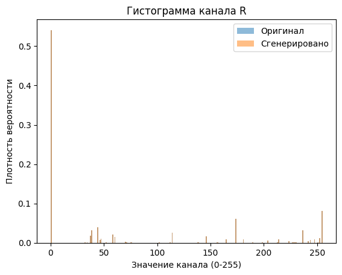  
- Канал **G**  
  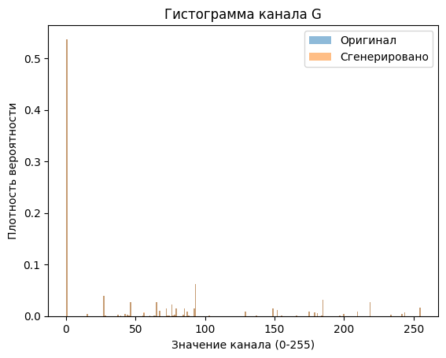  
- Канал **B**  
  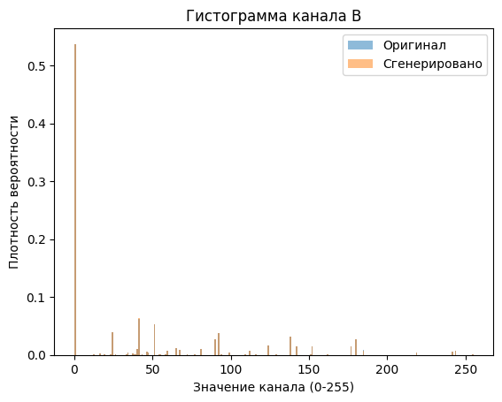  

На графиках видно, что распределения сгенерированных изображений повторяют статистику исходных данных (высокая вероятность у малых значений, хвостовые пики по каналам).  

---

# **Детекция аномалий в лунках**
### Краткое описание: обучить модель для детекции аномалий

---

## 1.Baseline модель

### Архитектура:

- Энкодер: 3 сверточных слоя
- Декодер: 3 транспонированных сверточных слоя (ConvTranspose)
- Латентное пространство: 128
- Loss: MSE

### Обучение (20 эпох):
Loss постепенно снижался с 0.00065 → 0.000036. Модель хорошо восстанавливает нормальные изображения.

### Результаты:

-Threshold = 0.000173
- TPR = 0.876, TNR = 0.558 (не достигают ≥95%)
- t-SNE: кластеры аномалий не отделяются → латентное пространство не различает состояния.

### Оптимальный порог (0.000116, train+proliv): 
- TPR=1.0, TNR=0.999
- На тесте:
    - Recall пролива: высокий 
    - Recall нормы: низкий
    - Accuracy: 42% 
    - Precision пролива: 0.05
    - → модель переобучилась на аномалии и не обобщается.


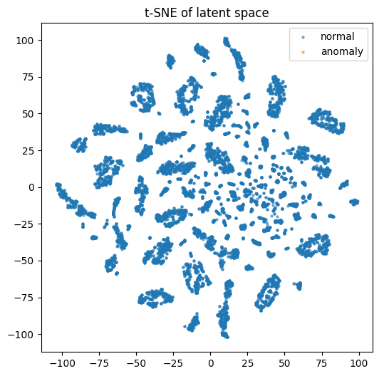
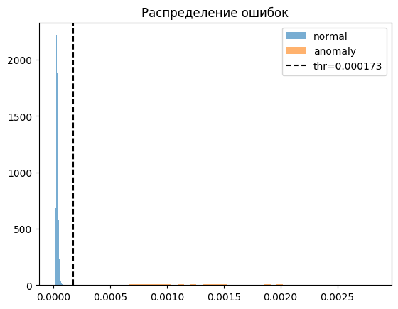

---

## 2.Улучшенная модель

### Модификации:

- Увеличена глубина сети, добавлены BatchNorm
- Латентное пространство расширено до 256
- Использованы аугментации данных
- Loss: MSE

### Обучение:

- Первая фаза: loss 0.0057 → 0.00028
- Вторая фаза: loss стабилизировался в диапазоне 0.00018–0.00028
- Обучение стабильное, без признаков переобучения

### Результаты:

- Оптимальный порог = 0.000402
- TPR = 0.974, TNR = 0.957 (≥95% выполнено на train+proliv)

### На тесте:

- Recall пролива = 79.9%
- Recall нормы = 77.5%
- Accuracy = 79.9%
- Precision пролива = 0.12
- F1 пролива = 0.207
- → модель лучше различает проливы, но критерий ≥95% на тесте не достигнут.

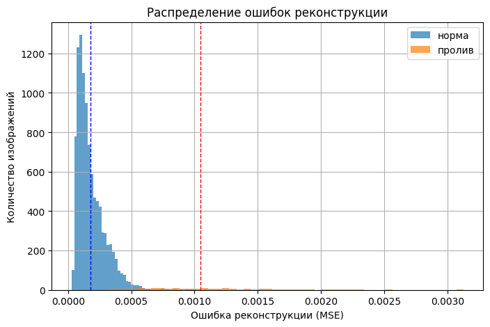

---

## Выводы

- Базовый автоэнкодер не обеспечивает требуемого качества (TPR и TNR < 0.95, переобучение).
- Усложнение архитектуры и аугментации позволили достичь TPR=0.974, TNR=0.957 на обучающей+валидационной выборке.
- На тесте качество составило ~80% accuracy, Recall пролива = 79.9%.
- Основная проблема: низкая точность (precision) → много ложных тревог.

Для улучшения можно попробовать не 1 чб канал и/или получши функцию лосс и/или посильнее модель