# 2025_deep_gen_models
Задача: генерация и перенос лиц

----

## Эксперименты

## 1. Обучить Stable Diffusion 1.5 на своем датасете (30 фото)

### Описание
Будем генерировать Тома Хиддлстона в разных окружениях. 

Для обучения используется библиотека diffusers и предобученные веса с civitai.com

### Лучшие параметры обучения
```
!python3 diffusers/examples/dreambooth/train_dreambooth.py \
  --pretrained_model_name_or_path=$MODEL_NAME \
  --instance_data_dir=$INSTANCE_DIR \
  --class_data_dir=$CLASS_DIR \
  --output_dir=$OUTPUT_DIR_2 \
  --instance_prompt="a photo of sks face" \
  --class_prompt="a photo of a man" \
  --seed=13498 \
  --with_prior_preservation \
  --prior_loss_weight=1.0 \
  --resolution=512 \
  --train_batch_size=1 \
  --learning_rate=1e-6 \
  --lr_scheduler="constant" \
  --lr_warmup_steps=152 \
  --gradient_accumulation_steps=1 \
  --num_class_images=228 \
  --max_train_steps=1520 \
  --checkpointing_steps=1520\
  --use_8bit_adam \
  --mixed_precision="no"\
  --train_text_encoder
```

###  Примеры генераций
Результат генерации для промпта: "close up photo of sks face, on the street, lights, midnight, NY, 4K, raw, hrd, hd, high quality, realism, sharp focus, detailed eyes"

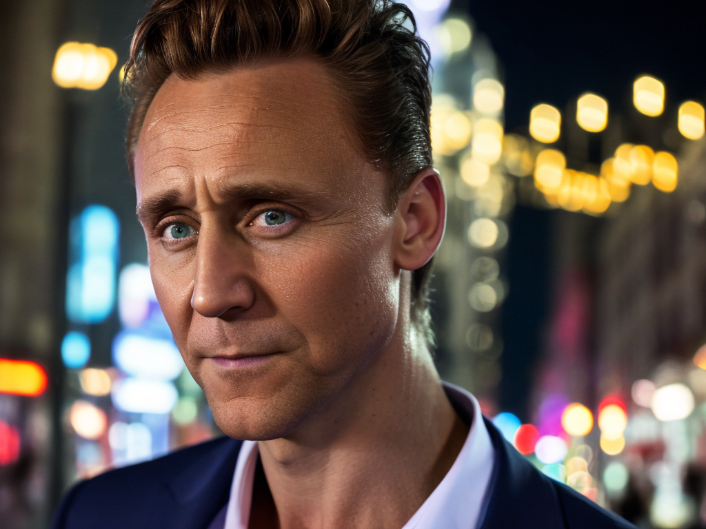

### Вывод
Для генерации персонажа очень важны параметры learning_rate и class_prompt. Чем ниже lr, тем чаще генерились двухголовые тела. Без class_prompt генерировался мужчина, иногда похожий на Тома или вообще рандомное лицо. Количество шагов чем больше, тем лучше. 

## 2. Обучить Lora адаптер

### Описание
Провести несколько экспериментов по выбору параметра **rank** при обучении Lora адаптера

Для теста возьмем параметр rank равный 4, 16, 24

### Параметры обучения
Все эксперименты проводились со следющими параметрами

```
!python diffusers/examples/dreambooth/train_dreambooth_lora.py \
  --pretrained_model_name_or_path=$MODEL_NAME \
  --instance_data_dir=$INSTANCE_DIR \
  --output_dir=$OUTPUT_DIR_n \
  --instance_prompt="a photo of sks face" \
  --seed=13498 \
  --resolution=512 \
  --train_batch_size=1 \
  --learning_rate=1e-4 \
  --lr_scheduler="constant" \
  --lr_warmup_steps=0 \
  --gradient_accumulation_steps=1 \
  --max_train_steps=1000 \
  --checkpointing_steps=1000\
  --validation_epochs=500 \
  --use_8bit_adam \
  --mixed_precision="no"\
  --rank=<4, 16, 24>
```

### Пример генерации

#### rank4
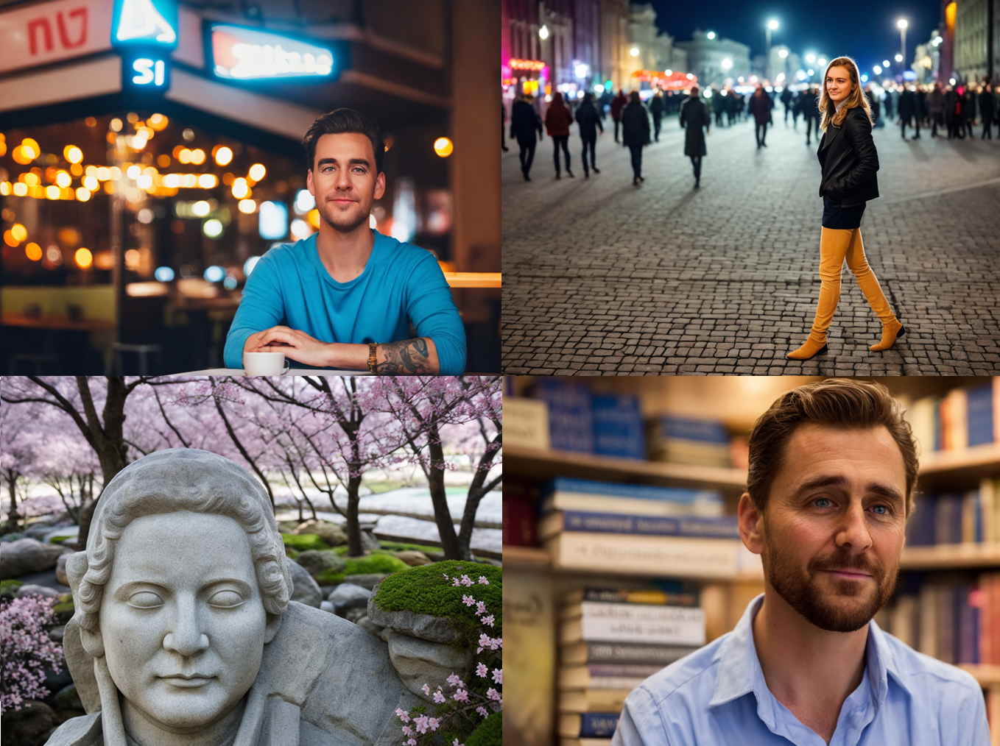
#### rank16
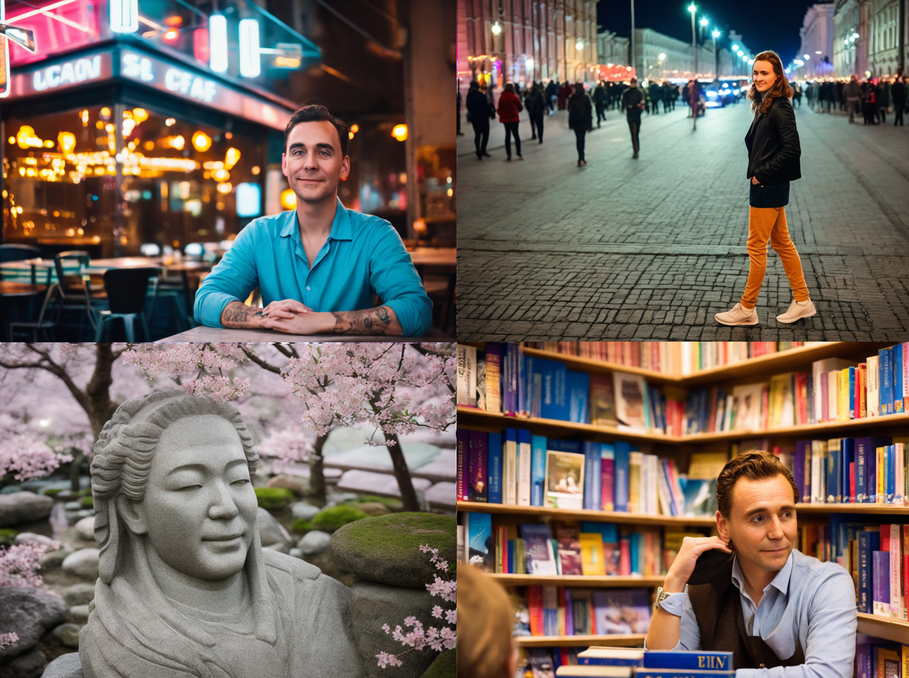
#### rank24
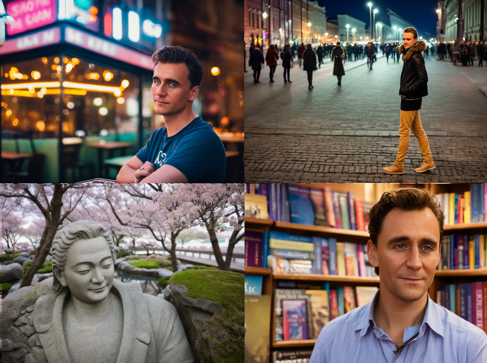

### Вывод
Lora учится быстрее, чем полный SD1.5. Нужно меньше итераций обучения и class_prompt не обязвтелен, и так хорошо. На качество генераций влияет параметр rank, но с какого-то момента повышать его нет смысла(rank 
16 и 24 в целом одинаково хороши) 


### 3. Сравнить лучшие checkpoint Unet и Lora адаптера
В ноутбуках уже зафиксированы промпты для генерации картинок в 5 разных окружениях и seed.

```
SEED=1337
token = "sks"
prompt_list = [
    {
        "name": "urban cafe",
        "prompt": f"close up portrait of {token} face, sitting in an urban cafe, neon signs, bokeh lights, street view through window, cozy, stylish, 4K, realism, sharp focus",
        "n_prompt": "naked, nsfw, deformed, distorted, disfigured, mutation, blurry, poorly drawn, bad anatomy",
    },
    {
        "name": "street",
        "prompt":f"сlose up portrait of {token} face, on the street, lights, midnight, Moscow, 4K, raw, hrd, hd, high quality, realism, sharp focus",
        "n_prompt":"naked, nsfw, deformed, distorted, disfigured, poorly drawn, bad anatomy, extra limb, missing limb, floating limbs, mutated hands, mutation, ugly, blurry",
    },
    {
        "name": "japanese garden",
        "prompt": f"close up portrait of {token} face, in a japanese zen garden, sakura trees, soft natural light, peaceful, 4K, high quality, realistic, calm",
        "n_prompt": "naked, nsfw, deformed, distorted, disfigured, poorly drawn, mutation, blurry, bad anatomy",
    },
    {
        "name": "bookshop",
        "prompt":f"close up portrait of {token} face, in the bookshop, books, soft light, 4K, raw, hrd, hd, high quality, realism, sharp focus",
        "n_prompt":"naked, nsfw, deformed, distorted, disfigured, poorly drawn, bad anatomy, extra limb, missing limb, floating limbs, mutated hands disconnected limbs, mutation, ugly, blurry, amputation",
    },
    {
        "name": "spaceship",
        "prompt":f"сlose up portrait of {token} face, in the spaceship, stars, planets, 4K, raw, hrd, hd, high quality, realism, sharp focus",
        "n_prompt":"naked, nsfw, deformed, distorted, disfigured, poorly drawn, bad anatomy, extra limb, missing limb, floating limbs, mutated hands, mutation, ugly, blurry",
    }
]
```

Для сравнения возьмем Unet (он один и самый лучший), и Lora адаптер с rank=24


| Окружение | Пример генерации SD1.5 | Пример генерации Lora |
| -------- | ------- | ------ |
| urban cafe | 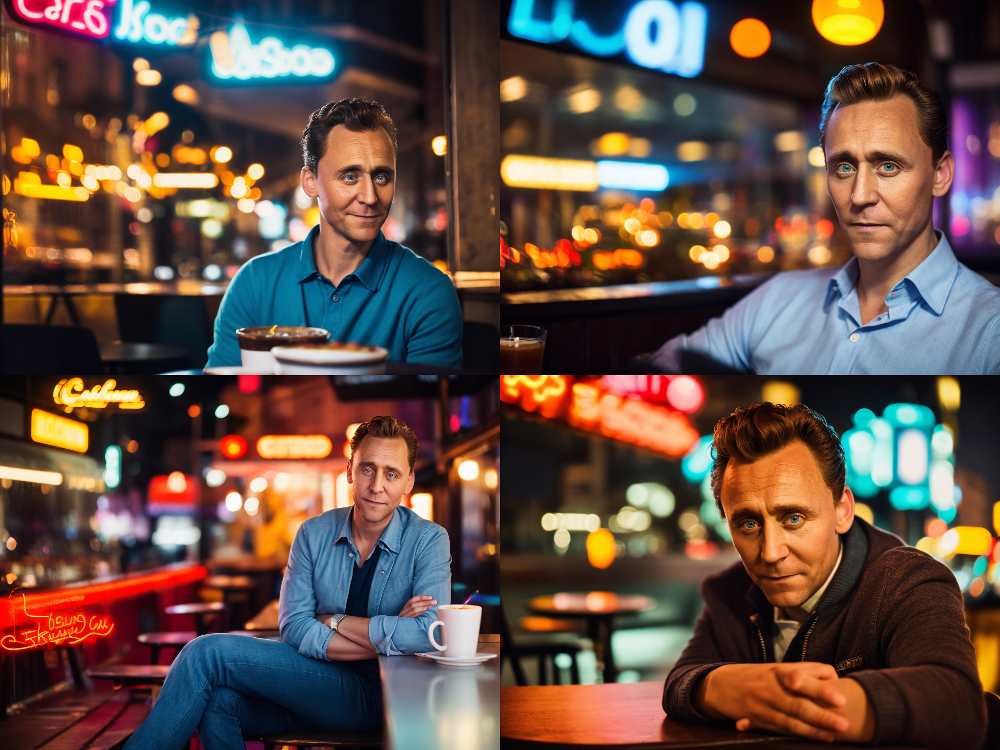 | 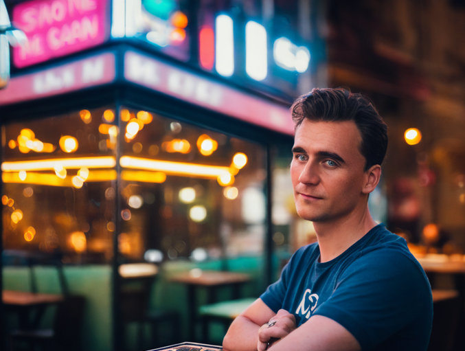 |
| street | 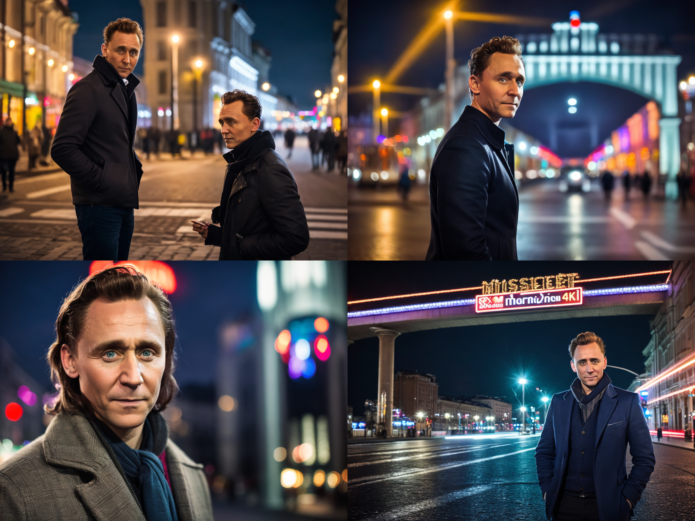 | 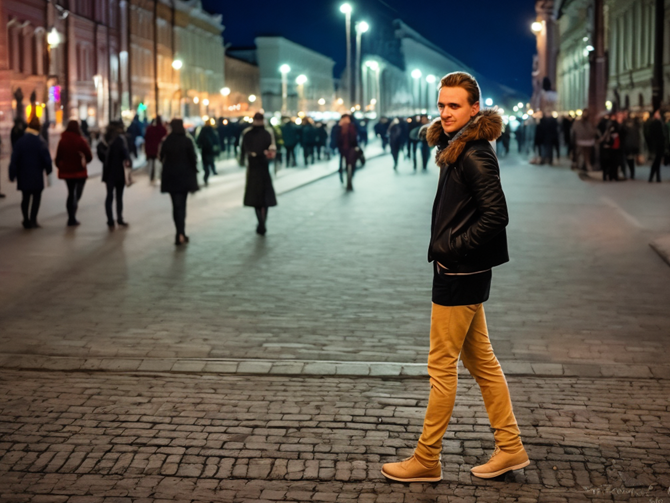
| japanese garden | 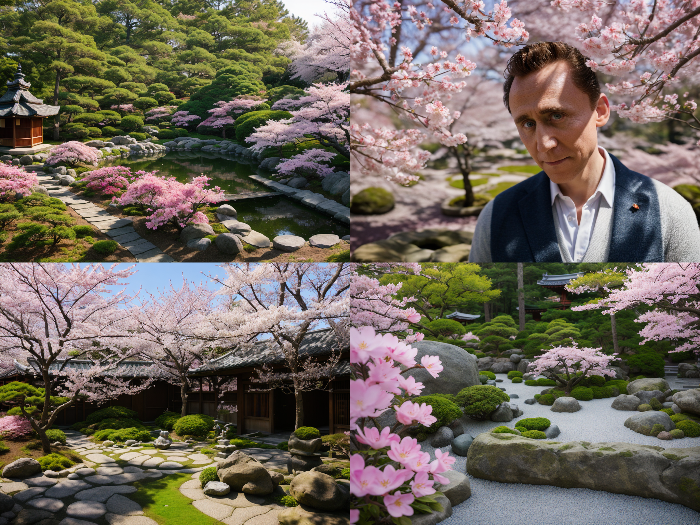 | 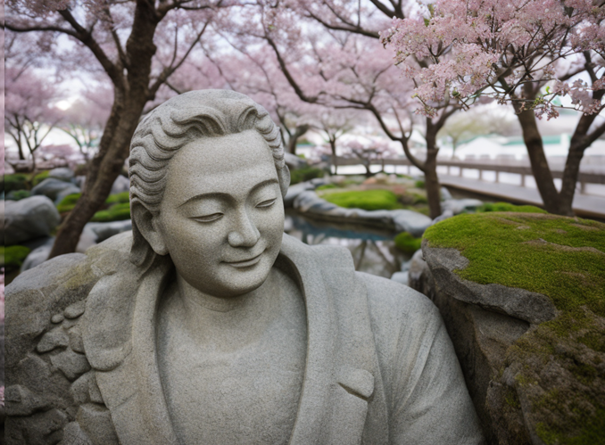|
| bookshop | 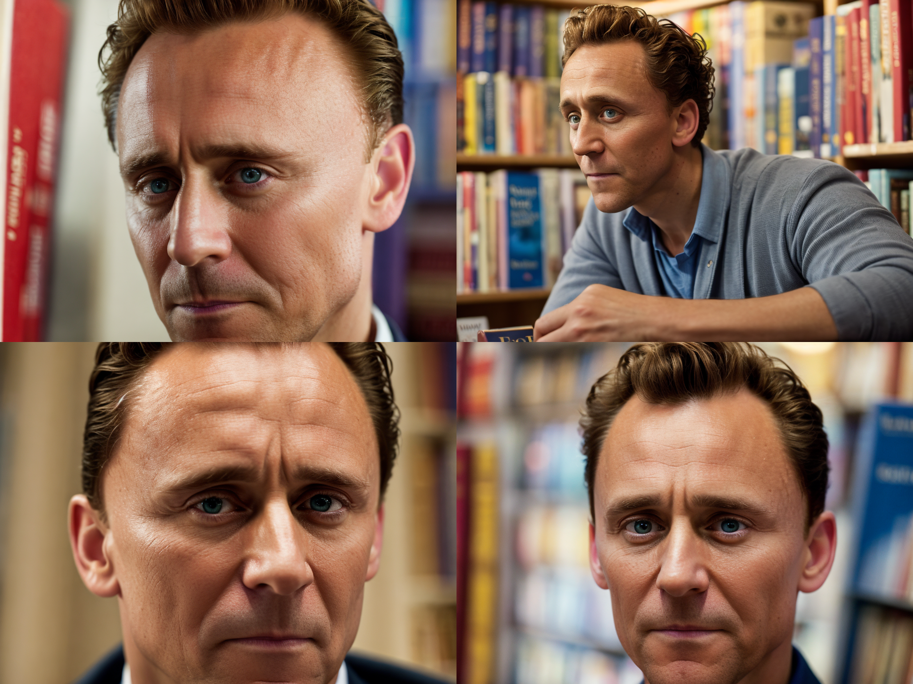 | 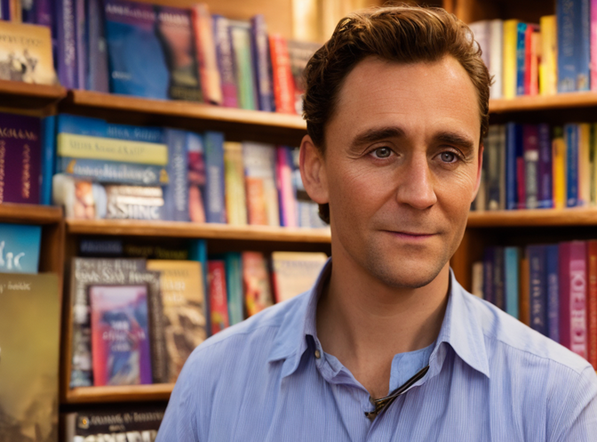 |


### Вывод
Мне кажется SD1.5 генерирует более похожие лица на Тома, чем лора   . 


## 4. ControlNet

### Описание

Добавить в пайплайн ControlNet для Unet и Lora адаптер

Будем использовать sd-controlnet-canny. Для референса возьмем портрет "молодого человека с медальоном" Сандро Боттичелли

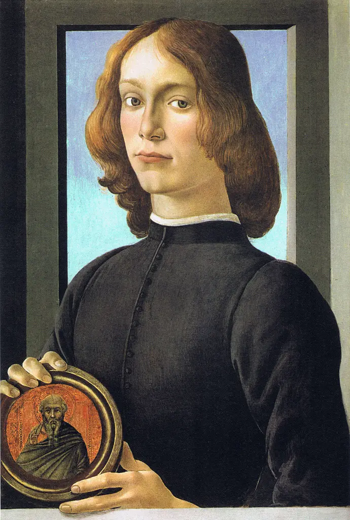
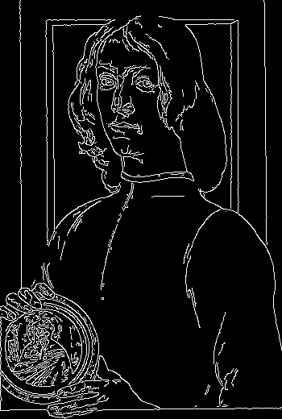

Для генерации для Unet и Lora используем промпт

```
prompt = "a photo of sks face, best quality, extremely detailed, 4k, hdr, super resolution"
```

###  Примеры генераций

**Unet**

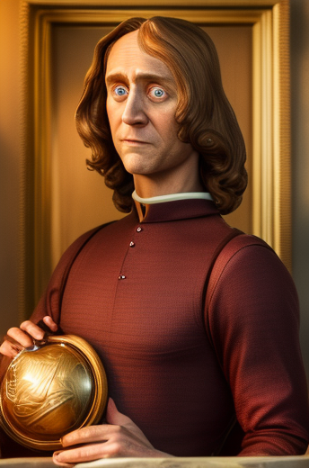
```
prompt = "a photo of sks face, best quality, extremely detailed, 4k, hdr, super resolution"
```

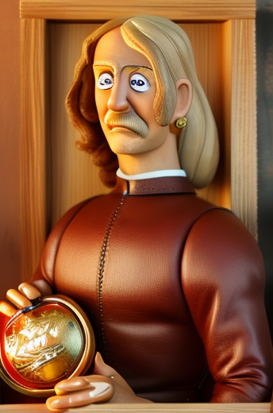
```
prompt = "a photo of sks face, best quality, extremely detailed, 4k, hdr, super resolution"
```


**Lora адаптер rank 16**

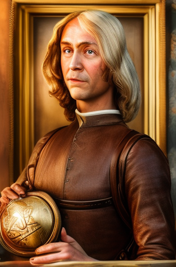
```
prompt = "a photo of sks face, best quality, extremely detailed, 4k, hdr, super resolution"
```

### Вывод
Лора делает более детальный фон и одежду, но лицо у Юнета более похоже. Так же еще сделали Потато фейс для веселья. На всех изображениях сохраняется поза, композиция и расположение объекта